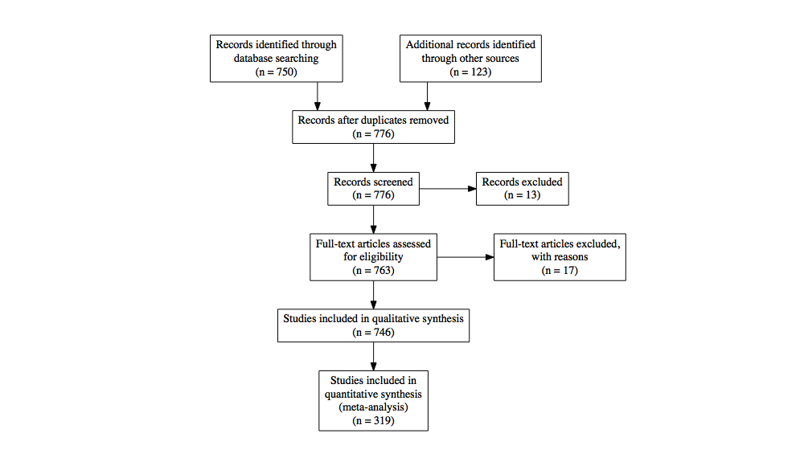

<!-- README.md is generated from README.Rmd. Please edit that file, then:
rmarkdown::render("README.Rmd")
-->

# PRISMAstatement

[](https://travis-ci.org/jackwasey/PRISMAstatement)
[](https://ci.appveyor.com/project/jackwasey/PRISMAstatement)
[](https://codecov.io/github/jackwasey/PRISMAstatement?branch=master)
[](https://cran.r-project.org/package=PRISMAstatement)

PRISMAstatement is a simple package which does one thing: generate
publication quality flow charts of study inclusions and exclusions
following recommendations of the PRISMA statement. See the vignette for
more details.

## Installation

You can install the released version of PRISMAstatement from
[CRAN](https://CRAN.R-project.org) with:

``` r
install.packages("PRISMAstatement")
```

And the development version from [GitHub](https://github.com/) with:

``` r
# install.packages("devtools")
devtools::install_github("jackwasey/PRISMAstatement")
```

## Example

``` r
library(PRISMAstatement)
prisma(found = 750,
       found_other = 123,
       no_dupes = 776, 
       screened = 776, 
       screen_exclusions = 13, 
       full_text = 763,
       full_text_exclusions = 17, 
       qualitative = 746, 
       quantitative = 319)
```


